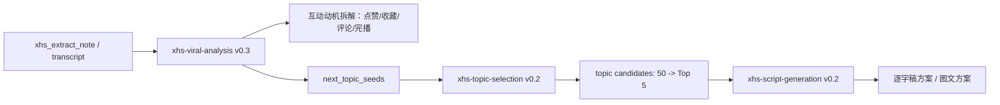

# 小红书爆款拆解 v0.3 优化设计方案（团队评审版）

日期：2026-05-21  
范围：`/Users/champion/Documents/develop/skills/xhs-content-pipeline`  
参考资料：`/Users/champion/Documents/develop/xhs` 下 124 个 ClawHub 小红书 skills 与《ClawHub 小红书 Skills 完整盘点》

## 1. 背景与目标

当前 `xhs-viral-analysis` 已经能拆：

- 前 15 秒钩子
- 框架类型 A/B/C
- 爆点
- 情绪曲线
- 爆款阈值
- 评论资产

用户新需求是把“拆解报告”升级成“可复用创作策略”：

1. 拆清楚为什么用户会点赞。
2. 拆清楚哪里让用户想收藏。
3. 拆清楚开头如何留人、如何提升完播。
4. 拆清楚中间内容如何触发评论、点赞、收藏。
5. 拆完后直接给下一条选题建议，比如再做一条模拟面试，该做什么方向。
6. 如果选题方向明确，能继续给出逐字稿方案。
7. 支持“像 Gemini 先给 50 个候选，再人工筛选”的大数候选池逻辑。

一句话目标：

> 从“这条为什么爆”升级为“这条的可复用互动机制是什么，下一条怎么做，能不能直接进入逐字稿”。

## 2. 对 `/Users/champion/Documents/develop/xhs` 的分析结论

### 2.1 文章层面的启发

《ClawHub 小红书 Skills 完整盘点》把小红书 skills 分为综合运营、内容发布、内容创作、图片卡片、数据采集、互动评论、视频下载分析、MCP/CLI 等类别。

对本次优化最相关的是四类：

| 类别 | 对 v0.3 的启发 |
|---|---|
| 内容创作辅助 | 不只拆已有内容，还要给新选题和新文案 |
| 数据采集与分析 | 选题建议需要来自拆解报告、评论资产、竞品样本，不是凭空想 |
| 互动管理与评论 | 评论不是尾部动作，而是内容中段就要设计的资产 |
| 视频下载与分析 | 视频拆解需要保留时间线，支持留存/完播判断 |

### 2.2 代表 skills 的可借鉴点

| Skill | 位置 | 可借鉴点 | 不直接采用的原因 |
|---|---|---|---|
| `xhs-content-generate` | `/Users/champion/Documents/develop/xhs/skills/xhs-content-generate` | “话题获取 → 参考内容 → 风格分析 → 内容生成”的链路；明确分析开头、结构、互动点 | 偏图文笔记生成，缺少对视频完播、收藏动机的细拆 |
| `xhs-viral-factory` | `/Users/champion/Documents/develop/xhs/skills/xhs-viral-factory` | 四种内容模式：治愈、知识百宝箱、认知升级、视觉流。其中“知识百宝箱=收藏”，“认知升级=评论”非常有价值 | 太偏自动生产工厂，需要拆成可审计的分析维度 |
| `xiaohongshu-algorithm-optimizer` | `/Users/champion/Documents/develop/xhs/skills/xiaohongshu-algorithm-optimizer` | 推荐逻辑分层：初始流量看点击+完读，中级流量看互动，高级流量看转粉+复看 | 有些提升百分比是经验表达，不应作为硬事实写入拆解结论 |
| `xiaohongshu-search-summarizer` | `/Users/champion/Documents/develop/xhs/skills/xiaohongshu-search-summarizer` | 搜关键词、取 Top N、合并正文/图片/评论，适合做选题热度扫描 | 依赖浏览器采集，适合作为可选增强，不作为 v0.3 必需依赖 |
| `xhs-video-analyzer` | `/Users/champion/Documents/develop/xhs/skills/xhs-video-analyzer` | 视频下载、转写、详细总结，强调不要只摘要，要保留原意 | Hermes 已有 `xhs_extract_note` 和转写链路，只借鉴总结结构 |
| `xhs-analytics` | `/Users/champion/Documents/develop/xhs/skills/xhs-analytics` | 热度分析、竞品对比、报告生成 | 需要 API/Cookie，作为未来增强 |

### 2.3 当前本地 pipeline 的差距

当前三个核心 skill：

- `xhs-viral-analysis`：拆解强，但输出停在“复刻清单”，没有足够解释点赞/收藏/评论动机，也没有强制给“下一条选题”。
- `xhs-topic-selection`：已经能选题，但通常作为另一步使用，没有从拆解报告里自动接收“下一条种子方向”。
- `xhs-script-generation`：能生成逐字稿，但入口要求选题已明确；缺少“从拆解直接生成逐字稿方案”的轻量桥接层。

所以 v0.3 的核心不是再新建一个大 skill，而是把三者串成：



## 3. v0.3 新增分析框架

### 3.1 第七维：互动动机拆解

在现有六维后新增“互动动机拆解”，分为点赞、收藏、评论、转发/关注四类。

#### A. 为什么会点赞

点赞不是“觉得有用”的弱表达，而是低成本认同。拆解时要判断它来自哪种心理：

| 点赞动机 | 判断问题 | 常见触发点 | 输出要求 |
|---|---|---|---|
| 共鸣点赞 | 用户是不是觉得“我也这样” | 痛点、尴尬、焦虑、被说中 | 标出原句和对应人群 |
| 认同点赞 | 用户是否认同观点/价值判断 | 反常识、行业真话、立场表达 | 说明观点为何容易被认同 |
| 爽感点赞 | 用户是否觉得“骂得好/问得狠/太真实” | 攻击式开场、压力面追问、强冲突 | 标出爽点位置 |
| 审美点赞 | 用户是否被视觉/口播状态吸引 | 封面、镜头、语速、气质 | 如果只有文本，必须标注“无法完全判断” |
| 支持点赞 | 用户是否因为博主身份/系列信任而支持 | vol 系列、老粉、身份背书 | 判断是否有系列复利 |

输出字段：

```yaml
like_motivation:
  primary: "爽感点赞"
  secondary: ["共鸣点赞", "认同点赞"]
  trigger_quotes:
    - quote: "你这个作品集里有几个真的是你主导的？"
      reason: "攻击式追问制造压力面爽感"
  score: 8
```

#### B. 哪个地方让大家会收藏

收藏通常不是情绪，而是“未来要用”。需要定位可保存资产。

| 收藏动机 | 判断问题 | 常见触发点 | 输出要求 |
|---|---|---|---|
| 工具收藏 | 这条是否能当清单/模板/框架反复看 | 50 问、答题框架、避坑清单 | 标出“可截图/可保存”的内容 |
| 焦虑收藏 | 用户是否怕自己以后用得上 | 面试、求职、装修、育儿、穿搭避雷 | 标出焦虑来源 |
| 复盘收藏 | 用户是否需要拿它自查 | 面试问题、作品集 checklist | 标出自查路径 |
| 资料领取收藏 | 收藏和领取资料是否绑定 | CTA、评论关键词、资料包 | 标出转化动作 |
| 图卡收藏 | 图文每张是否独立可用 | 图 1-N 的知识卡片 | 逐图评分 |

输出字段：

```yaml
collect_motivation:
  primary: "工具收藏"
  key_assets:
    - "18 个面试追问"
    - "80% 处的项目复盘反转"
    - "50 问清单 CTA"
  exact_positions:
    - "主体 20%-78%：连续问题密度"
    - "80%-88%：教育型反转"
  score: 9
```

#### C. 中间内容如何吸引评论、点赞、收藏

中段不再只看“干货展开”，要拆成“互动触发节点”。

| 中段节点 | 触发互动 | 例子 | 诊断问题 |
---|---|---|---|
| 高频具体问题 | 收藏/完播 | 连续 18 个面试题 | 每 5-10 秒是否有一个新具体点？ |
| 争议判断 | 评论/点赞 | “这不是表达问题，是复盘训练不够” | 是否有可反驳、可补充的观点？ |
| 信息缺口 | 评论/完播 | “后面还有更难的追问” | 是否制造继续看的理由？ |
| 身份背书插入 | 点赞/关注 | “15 年面试官经验” | 是否增强可信度而不打断节奏？ |
| 可领取资产提示 | 评论/转化 | “50 问清单” | 用户是否知道评论/私信要拿什么？ |

### 3.2 第八维：留存与完播拆解

增加“开头如何留人、完播如何撑住”的分析。按视频时间线输出。

| 阶段 | 目标 | 诊断维度 |
|---|---|---|
| 0-3 秒 | 停止划走 | 是否直接进入场景/痛点/冲突；是否避免自我介绍 |
| 3-15 秒 | 建立观看理由 | 是否明确“看下去能获得什么”或让观众代入 |
| 15-60 秒 | 防止流失 | 是否每 5-10 秒给新信息点 |
| 60-80% | 维持期待 | 是否有逐步升级的难度/冲突/信息密度 |
| 80%-90% | 最高峰 | 是否有教育型反转/金句/框架总结 |
| 90%-100% | 转化 | CTA 是否自然，不破坏专业感 |

输出字段：

```yaml
retention_analysis:
  first_3s: "攻击式问题，强制观众代入面试现场"
  first_15s: "没有解释背景，直接进入压力面，留人强"
  mid_watch_drivers:
    - "问题密度高，每 6-8 秒一个新追问"
    - "观众会不断自测自己能否回答"
  completion_risk:
    - "若问题之间语气太平，可能中段疲劳"
  completion_score: 8
```

### 3.3 第九维：下一条选题建议

拆解报告默认给 3-5 个“下一条选题种子”，不再让用户另起一步问。

选题种子必须包含：

- 方向名称
- 为什么从这条拆解里推导出来
- 适合复用哪个钩子
- 适合复用哪个框架
- 预期点赞/收藏/评论主驱动
- 为什么可能火
- 需要准备什么素材
- 是否适合进入逐字稿

输出例：

```markdown
## 九、下一条选题建议

### 方向 1：vol.14 字节 UX 作品集深挖面试模拟
- **来源**：复用“沉浸式压力面 + 攻击式开场”，换成作品集深挖场景
- **为什么可能火**：作品集是设计岗面试最高频痛点，观众会边看边自测，收藏动机强
- **主互动驱动**：收藏 > 点赞 > 评论
- **收藏触发点**：18 个作品集追问 + 50 问清单
- **评论触发点**：让观众评论“哪个追问最不会答”
- **逐字稿可行性**：高，可直接进入 xhs-script-generation
```

### 3.4 第十维：逐字稿方案入口

如果选题方向已经明确，`xhs-viral-analysis v0.3` 不直接输出完整逐字稿，但必须输出“逐字稿方案”，作为 `xhs-script-generation` 输入。

逐字稿方案包括：

```yaml
script_brief:
  topic: "字节 UX 作品集深挖面试模拟"
  note_type: "video"
  recommended_framework: "B 情境再现型"
  opening_strategy: "攻击式开场"
  mid_content_strategy: "18 个具体追问，每个 5-10 秒"
  like_trigger: "压力面爽感 + 专业认同"
  collect_trigger: "作品集追问清单"
  comment_trigger: "让用户说出最不会答的问题"
  cta_asset: "大厂 UX 作品集深挖 50 问"
```

由 `xhs-script-generation` 接收后生成完整逐字稿。

## 4. Skill 改造方案

### 4.1 `xhs-viral-analysis` 升级到 v0.3

新增输入字段：

```yaml
analysis_goal:
  type: "breakdown_only | breakdown_plus_topics | breakdown_plus_script_brief"
candidate_count:
  default: 5
creator_recent_direction:
  example: "继续做模拟面试系列，偏压力面"
```

新增输出章节：

```markdown
## 七、互动动机拆解

### 1. 为什么会点赞
- 主动机：...
- 触发原句/画面：...
- 可复用机制：...

### 2. 为什么会收藏
- 主动机：...
- 可保存资产：...
- 收藏触发位置：...

### 3. 为什么会评论
- 评论资产类型：...
- 评论触发点：...
- 如果当前评论少，应该补什么评论引导：...

## 八、留存与完播拆解

| 时间段 | 留人机制 | 原文/画面证据 | 风险 |
|---|---|---|---|

## 九、下一条选题建议

给 3-5 个方向，每个方向说明为什么可能火。

## 十、逐字稿方案（如果方向明确）

给 `xhs-script-generation` 可直接消费的 brief。
```

### 4.2 `xhs-topic-selection` 升级到 v0.2

把用户提到的 Gemini 工作流正式产品化：

> 先生成 50 个候选，再按博主匹配度、选题热度、可执行性、互动动机筛选 Top 5。

新增输入：

```yaml
topic_seed_from_breakdown:
  - "压力面"
  - "作品集深挖"
  - "字节 UI/UX"
candidate_pool_size:
  default: 50
```

新增评分维度：

| 维度 | 权重 | 说明 |
|---|---:|---|
| 博主匹配度 | 0.30 | 是否复用已爆配方 |
| 赛道痛点强度 | 0.25 | 是否是真需求 |
| 收藏资产强度 | 0.20 | 是否能沉淀清单/模板/框架 |
| 评论资产强度 | 0.15 | 是否能引发补充/提问/争议 |
| 可执行性 | 0.10 | 当前能不能拍 |

### 4.3 `xhs-script-generation` 升级到 v0.2

接收 `script_brief`，生成稿子时必须显式标注：

- 开头留人机制
- 中段点赞触发点
- 中段收藏触发点
- 中段评论触发点
- 完播峰值位置
- CTA 资产

逐字稿输出增加：

```markdown
## 互动设计标注版逐字稿

| 段落 | 秒数 | 文案 | 目标互动 | 机制 |
|---|---:|---|---|---|
| 钩子 | 0-8s | ... | 留存/点赞 | 攻击式压力面 |
| 主体 1 | 8-45s | ... | 收藏/完播 | 高频追问 |
| 主体 2 | 45-120s | ... | 评论/收藏 | 信息缺口 |
| 反转 | 120-135s | ... | 收藏/点赞 | 教育型反转 |
| CTA | 135-150s | ... | 评论/转化 | 资料领取 |
```

## 5. 路飞/模拟面试场景专项模板

用户明确提到：“很多问题是 Gemini 梳理的 50 个里挑选的，但我给了 Gemini 方向，比如压力面。”

v0.3 应把这套经验固定为：

### 输入

```yaml
creator: "路飞"
niche: "设计师求职 / 大厂 UX 面试"
known_winning_format: "沉浸式模拟面试"
direction_hint: "压力面"
candidate_pool_size: 50
```

### 候选生成分组

50 个候选不要平铺，应按 5 组生成：

1. 公司维度：字节、腾讯、美团、阿里、快手、小米。
2. 岗位维度：UI、UX、交互、体验设计、B 端设计、AI 产品设计。
3. 面试类型：压力面、作品集深挖、业务复盘、主管终面、HR 价值观面。
4. 人群维度：校招、1-3 年、3-5 年、高级别。
5. 内容形态：视频模拟、图文框架、评论答疑、直播切片。

### Top 方向示例

| 方向 | 为什么可能火 | 主互动 |
|---|---|---|
| 字节 UX 作品集深挖压力面 | 作品集是最高频焦虑；压力面有爽感；字节自带流量 | 收藏 + 完播 |
| 腾讯 AI 产品体验设计面 | AI 产品热度高；“设计师会不会被 AI 替代”有争议 | 评论 + 收藏 |
| 美团 B 端业务复盘面 | B 端设计师缺参考样本；项目复盘能沉淀模板 | 收藏 |
| 高级别设计岗主管终面 | 目标人群高客单；问题更难，转化潜力强 | 收藏 + 私域转化 |
| 校招作品集连环追问 | 受众广；适合评论区提问“我这个项目怎么答” | 评论 + 收藏 |

## 6. 评审拍板点

### P0：必须拍板

- 是否同意 `xhs-viral-analysis` 从六维升级到十维：新增互动动机、留存完播、下一条选题、逐字稿 brief。
- 是否同意拆解报告默认输出 3-5 个下一条选题建议。
- 是否同意 `xhs-topic-selection` 正式采用“50 个候选 → Top 5”的大数候选池模式。
- 是否同意 `xhs-script-generation` 输出“互动设计标注版逐字稿”。

### P1：实现优先级

建议顺序：

1. 先改 `xhs-viral-analysis` 输出契约。
2. 再改 `xhs-topic-selection` 候选池评分。
3. 最后改 `xhs-script-generation` 输出格式。

理由：拆解报告是上游，如果上游不先产出 `next_topic_seeds` 和 `script_brief`，下游生成仍然闭门造车。

### P2：后续增强

- 接入 `xiaohongshu-search-summarizer` 思路，自动搜索关键词 Top N，给选题热度补证据。
- 接入真实评论样本后，让 `xhs-comment-intelligence` 反哺选题。
- 把拆解报告中的互动动机结构化写入知识库，形成“博主个人爆款配方库”。

## 7. 验收标准

用同一条模拟面试视频测试，v0.3 报告必须比 v0.2 多回答这些问题：

1. 为什么用户会点赞？
2. 哪些内容让用户想收藏？
3. 开头 3 秒、15 秒分别靠什么留住人？
4. 中段哪些节点会触发评论、点赞、收藏？
5. 下一条如果继续做模拟面试，至少给 3 个方向，并说明为什么会火。
6. 选定一个方向后，能产出 `script_brief`，可直接交给 `xhs-script-generation`。

如果报告仍只停留在“钩子好、结构完整、评论资产无法判断”，则 v0.3 不通过。

## 8. 建议结论

建议推进。

这次优化不是增加花哨章节，而是把 lishoubo/路飞已经在手工做的工作流产品化：

> 给方向 → 生成 50 个候选 → 人工筛选 → 拆解为什么会火 → 确定下一条 → 生成逐字稿。

v0.3 应该让 Agent 在拆解结束时主动给出下一步，而不是等用户再问“那我下一条做什么”。
